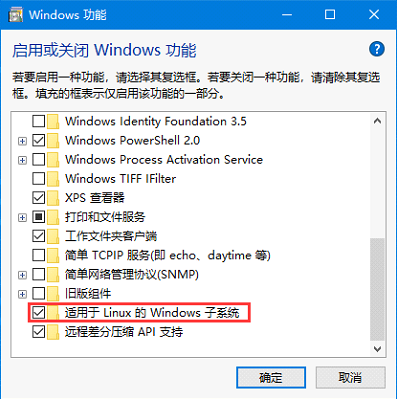
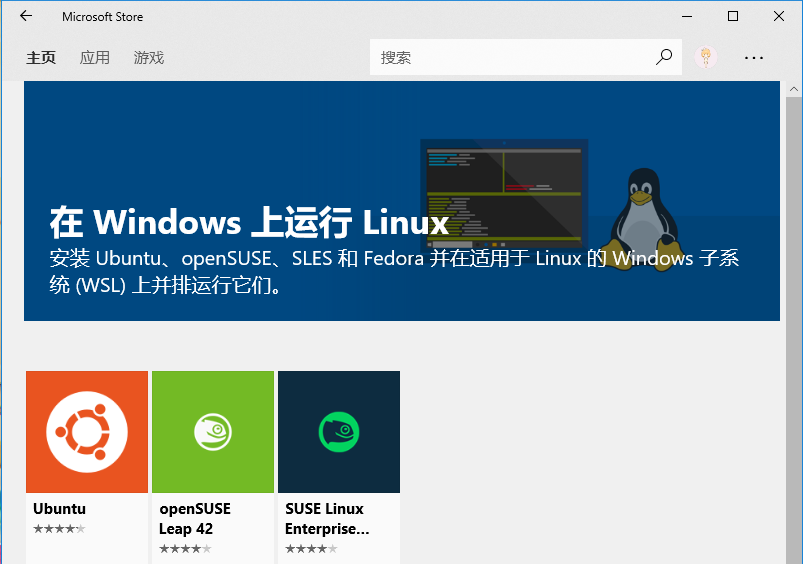
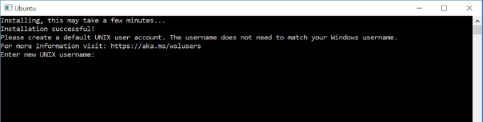

### 一、WSL安装：

1. 管理员权限运行powershell并运行下面的命令：

```
Enable-WindowsOptionalFeature -Online -FeatureName Microsoft-Windows-Subsystem-Linux
```

**或者：**控制面板->程序和功能->启用或关闭Windows功能->勾选 适用于Linux的Windows子系统



2. 重启电脑

3.  打开应用商城搜索“WSL”，安装Windows Terminal，并安装Ubuntu XX.XX LTS



4.  安装完成后可在开始菜单里找到快捷方式并启动，第一次运行需要等待安装并设置用户名、密码。



5. WSL设置默认登陆用户

当我们运行WSL时，它会用第一次运行时输入的用户名登陆，如果想改为其他用户，可以（以ubuntu1804为例）：

```
ubuntu1804 config --default-user root
```

### 二、安装vim

1. 一般情况可用系统默认的vim，如有特别需要可以去https://ftp.nluug.nl/pub/vim/unix, 下载需要的版本

2.vim配置插件，推荐plug

```
curl -fLo ~/.vim/autoload/plug.vim --create-dirs \
    https://raw.githubusercontent.com/junegunn/vim-plug/master/plug.vim
```

3. 然后在~/.vimrc中添加需要的插件及配置，最后在vim命令模式执行`:PlugInstall`

```
call plug#begin('~/.vim/plugged')
"这中间放需要的插件
"Plug 'junegunn/vim-easy-align'
" Initialize plugin system
call plug#end()
```

4.我的配置推荐https://github.com/smgcs/tools/blob/master/vimrc, 改好配置之后记得在vim命令模式执行`:PlugInstall`

### 三、安装vim-go(包括go代码跳转、自动补全等)

1. 安装golang（在安装vim-go之前先安装golang）

```
wget https://golang.org/dl/go1.14.linux-amd64.tar.gz
tar -C /usr/local -xzf go1.14.linux-amd64.tar.gz
export PATH=$PATH:/usr/local/go/bin #add environment variable
go version
```

2.安装golang，跳转、编译等vim工具，打开一个go文件，在命令模式执行`:GoInstallBinaries`，由于国内网络环境可能需要上网工具

3.vim-go用法，及快捷键映射(可自行配置)

①、在~/.vimrc配置`map <c-]> :GoDef<CR> `表示`Ctrl+]`会跳转go定义的地方

②、用法

```
编译		    :GoBuild
安装		    :GoInstall
导包		    :GoImport
导需要的包    :GoImports
运行		    :GoRun
引用		    :GoReferrers
帮助执行      :h vim-go
```

4.代码自动补全，需要安装YouCompleteMe

①、依赖：cmake，python3-dev（安装python3-dev的时候记得用utuntu的源，不要用阿里的，大坑）apt install -f cmake python3-dev

②、安装：cd ~/.vim/plugged/YouCompleteMe，执行python3 install.py --go-completer（golang的自动补全）

至此大功告成

注：我的vim配置还包括，注释插件，git分支，文件结构，代码结构，LeetCode，参数自动补全等

参考

1、[WSL(Windows Subsystem for Linux)的安装与使用](https://www.cnblogs.com/JettTang/p/8186315.html)
